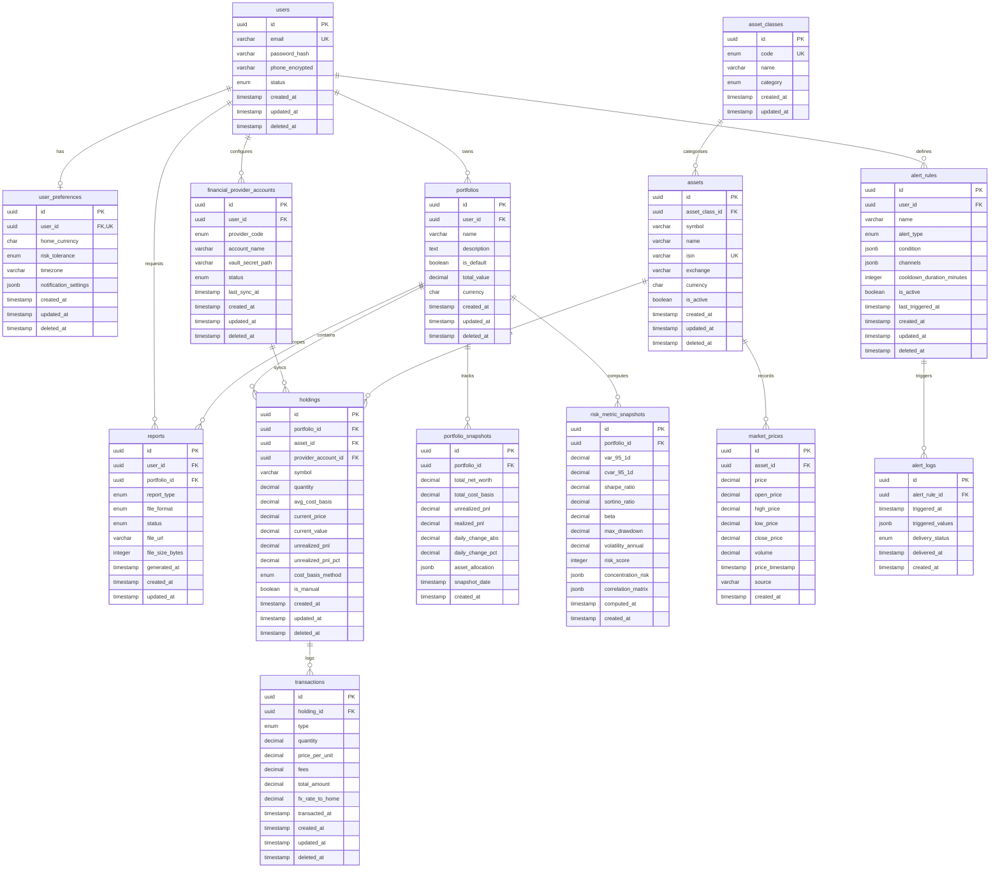

# Database Architecture & Schema Specification

This document provides the authoritative PostgreSQL database architecture, Entity-Relationship Diagram (ERD), data dictionary, indexing strategy, and financial precision standards for the **Investor Portfolio Monitoring & Risk Management System**.

---

## 1. Overview & Technology Selection

| Component                  | Technology                      | Purpose                                                                           |
| :------------------------- | :------------------------------ | :-------------------------------------------------------------------------------- |
| **Relational Database**    | PostgreSQL 16 (TimescaleDB)     | ACID transactions, strict financial schema compliance, multi-column indexes       |
| **ORM / Migration Engine** | Prisma ORM 5.x                  | Declarative schema definitions, type-safe client generation, migration management |
| **Schema Location**        | `apps/api/prisma/schema.prisma` | Core domain models                                                                |
| **Migration Location**     | `apps/api/prisma/migrations/`   | Versioned SQL migration scripts                                                   |

---

## 2. Entity-Relationship Diagram (ERD)

---

## 3. Financial Precision Standards

To prevent floating-point rounding errors in multi-currency portfolio calculations:

1. **Asset Quantities & Unit Prices**: Stored as `@db.Decimal(18, 8)`.
   - Supports fractional cryptocurrency (e.g. Satoshi precision down to `0.00000001` BTC).
   - Supports fractional mutual fund units and exact per-unit purchase prices.
2. **Monetary Valuations & Currency Amounts**: Stored as `@db.Decimal(18, 4)`.
   - Used for `total_value`, `current_value`, `unrealized_pnl`, `total_net_worth`, transaction fees, and total settlement amounts.
3. **FX Rates**: Stored as `@db.Decimal(18, 8)`.
   - Ensures precise cross-currency conversions (e.g. USD/INR, EUR/INR, BTC/INR).

---

## 4. Audit Fields & Soft Deletion Strategy

All primary domain entities incorporate standard audit columns:

- `created_at` (`DateTime @default(now())`): Immutable record creation timestamp.
- `updated_at` (`DateTime @updatedAt`): Automatically updated timestamp on write.
- `deleted_at` (`DateTime?`): Nullable soft-delete timestamp.

### Soft Delete Execution Policy

Entities are soft-deleted by setting `deleted_at = NOW()`. Queries filter active records using `WHERE deleted_at IS NULL`. Composite indexes such as `[user_id, deleted_at]` and `[portfolio_id, deleted_at]` optimize query paths.

---

## 5. Table Dictionary & Indexing Strategy

### 5.1 Identity & Access Domain

#### `users` Table

Stores authentication credentials and user profile status.

- **Primary Key**: `id` (UUID)
- **Unique Indexes**: `email`
- **Composite/Single Indexes**: `[status]`, `[deleted_at]`

#### `user_preferences` Table

Stores user settings and risk profile choices.

- **Primary Key**: `id` (UUID)
- **Foreign Keys**: `user_id` -> `users(id)` ON DELETE CASCADE
- **Unique Indexes**: `user_id`

---

### 5.2 Portfolio & Ingestion Domain

#### `portfolios` Table

Top-level portfolio container owned by users.

- **Primary Key**: `id` (UUID)
- **Foreign Keys**: `user_id` -> `users(id)` ON DELETE CASCADE
- **Indexes**: `[user_id, deleted_at]`

#### `financial_provider_accounts` Table

External integration credentials metadata (Zerodha, Groww, Binance, ICICI Direct, WazirX, Manual).

- **Primary Key**: `id` (UUID)
- **Foreign Keys**: `user_id` -> `users(id)` ON DELETE CASCADE
- **Security**: Sensitive API tokens and provider secrets stored in `encrypted_credentials` encrypted via AES-256-GCM.
- **Indexes**: `[user_id, provider_code]`, `[status]`

---

### 5.3 Asset & Position Domain

#### `asset_classes` Table

Reference lookup for the 8 system asset classes.

- **Primary Key**: `id` (UUID)
- **Unique Indexes**: `code`

#### `assets` Table

Master financial asset dictionary.

- **Primary Key**: `id` (UUID)
- **Foreign Keys**: `asset_class_id` -> `asset_classes(id)` ON DELETE RESTRICT
- **Unique Indexes**: `isin`, `[symbol, exchange]`
- **Indexes**: `[symbol]`, `[asset_class_id]`

#### `holdings` Table

Asset positions held within a portfolio.

- **Primary Key**: `id` (UUID)
- **Foreign Keys**:
  - `portfolio_id` -> `portfolios(id)` ON DELETE CASCADE
  - `asset_id` -> `assets(id)` ON DELETE RESTRICT
  - `provider_account_id` -> `financial_provider_accounts(id)` ON DELETE SET NULL
- **Indexes**: `[portfolio_id, symbol]`, `[portfolio_id, deleted_at]`, `[asset_id]`, `[provider_account_id]`

#### `transactions` Table

Ledger of historical asset purchase/sale events.

- **Primary Key**: `id` (UUID)
- **Foreign Keys**: `holding_id` -> `holdings(id)` ON DELETE CASCADE
- **Indexes**:
  - `[holding_id, transacted_at]`
  - `[holding_id, deleted_at, transacted_at]` _(Tuned composite B-tree index for FIFO/Weighted average cost queries)_
  - `[transacted_at]`
  - `[type]`

---

### 5.4 Analytics, Valuation & Alert Domain

#### `market_prices` Table

Historical price tick storage for assets.

- **Primary Key**: `id` (UUID)
- **Foreign Keys**: `asset_id` -> `assets(id)` ON DELETE CASCADE
- **Indexes**: `[asset_id, price_timestamp]`, `[price_timestamp]`

#### `portfolio_snapshots` Table

Daily aggregated portfolio net worth records.

- **Primary Key**: `id` (UUID)
- **Foreign Keys**: `portfolio_id` -> `portfolios(id)` ON DELETE CASCADE
- **Indexes**: `[portfolio_id, snapshot_date]`, `[snapshot_date]`

#### `risk_metric_snapshots` Table

Quantitative risk engine calculation outputs (VaR, CVaR, Sharpe, Beta, Max Drawdown).

- **Primary Key**: `id` (UUID)
- **Foreign Keys**: `portfolio_id` -> `portfolios(id)` ON DELETE CASCADE
- **Indexes**: `[portfolio_id, computed_at]`

#### `alert_rules` & `alert_logs` Tables

Automated rule definitions and triggered alert log instances.

- **Foreign Keys**:
  - `alert_rules.user_id` -> `users(id)` ON DELETE CASCADE
  - `alert_logs.alert_rule_id` -> `alert_rules(id)` ON DELETE CASCADE
- **Indexes**: `[user_id, is_active]`, `[alert_rule_id, triggered_at]`, `[delivery_status]`

#### `reports` Table

PDF and CSV generated export metadata.

- **Foreign Keys**: `user_id` -> `users(id)` ON DELETE CASCADE, `portfolio_id` -> `portfolios(id)` ON DELETE SET NULL
- **Indexes**: `[user_id, status]`, `[created_at]`

---

## 6. Related Documentation

- [Master Data Dictionary](docs/DATA_DICTIONARY.md) — Comprehensive schema specifications, exact column data types, precision standards, and domain events.
- [API Contract](API_CONTRACT.md) — REST API endpoints and data transfer contracts.
- [Setup Guide](docs/SETUP_GUIDE.md) — Database migration commands and developer onboarding.
- [Troubleshooting Runbook](docs/TROUBLESHOOTING.md) — Common database, migration, and connection pool diagnostics.
