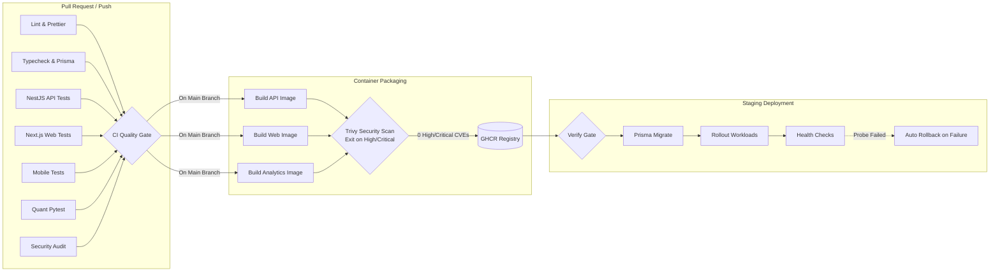

# Wealth Compass: Investor Portfolio Monitoring & Risk Management System

An enterprise-grade, multi-tenant financial aggregation, quantitative risk analytics, and portfolio monitoring platform tailored for the **Indian Financial Ecosystem**.

## 🚀 Overview

Wealth Compass solves the problem of financial data fragmentation for retail and high-net-worth investors holding assets across multiple platforms (brokerages, mutual fund portals, banks, crypto exchanges, and real estate). It acts as a central command center providing a unified net worth view, asset allocation analysis, and deep quantitative risk metrics.

## ✨ Key Features

- **Multi-Platform Ingestion**: Aggregates data from NSE/BSE brokers (Zerodha, Upstox), CAMS/KFintech Mutual Fund CAS statements, and the RBI Account Aggregator framework.
- **Deterministic Valuation Engine**: Fixed-precision `Decimal(18,8)` math to eliminate floating-point inaccuracies. Calculates FIFO and Weighted Average cost basis.
- **Quantitative Risk Analytics**: High-performance Python engine calculating Time-Weighted Return (TWR), XIRR, Volatility, Sharpe Ratio, Sortino Ratio, Beta, and Value at Risk (VaR).
- **Concentration & Diversification**: Herfindahl-Hirschman Index (HHI) concentration tracking and correlation-weighted diversification scoring.
- **Indian Financial Year Engine**: Automated 31st March midnight portfolio snapshots and generation of ITR-ready Capital Gains (STCG/LTCG) tax reports.
- **Automated Alerting**: Configurable rules for portfolio drawdown, volatility spikes, and pre-March 31st tax-loss harvesting opportunities.

## 🛠️ Technology Stack

- **Architecture**: Modular Monolith (NestJS) + Python Microservice (FastAPI) in a Turborepo Workspace.
- **Frontend**: Next.js 14 (App Router), React 18, Tailwind CSS, Shadcn UI, Recharts.
- **Mobile**: React Native, Expo.
- **Backend**: NestJS, TypeScript, PostgreSQL 16, Prisma ORM, Redis 7, BullMQ.
- **Quant Service**: Python 3.11, FastAPI, NumPy, pandas, SciPy.
- **DevOps**: Docker, GitHub Actions, AWS (ECS Fargate, RDS, ElastiCache).

## 📦 Project Structure

This project uses a [Turborepo](https://turbo.build/) monorepo structure:

- `apps/api`: NestJS REST Backend
- `apps/web`: Next.js 14 Web Frontend
- `apps/mobile`: React Native Expo Mobile App
- `services/analytics`: Python FastAPI Quantitative Service
- `packages/*`: Shared configurations, UI components, and TypeScript DTOs.

## 🚀 Quick Start

Ensure you have [Docker](https://www.docker.com/), [Node.js](https://nodejs.org/) (v20+), and [pnpm](https://pnpm.io/) installed.

1. **Install dependencies:**
   ```bash
   pnpm install
   ```
2. **Start Infrastructure (PostgreSQL & Redis):**
   ```bash
   docker-compose up -d
   ```
3. **Run Database Migrations:**
   ```bash
   pnpm --filter api run db:migrate
   ```
4. **Start Development Servers:**
   ```bash
   pnpm dev
   ```

## 🔄 CI/CD Automation & Build Pipelines

Wealth Compass enforces production-grade DevOps automation through three orchestrated GitHub Actions workflows designed for high parallelism, reproducible layer caching, and strict security build gates.



### 1. Continuous Integration & Quality Gates (`.github/workflows/ci.yml`)

- **Parallel Job Matrix**: Executes 7 independent jobs concurrently (`ubuntu-latest`), keeping PR feedback times well under the 8-minute SLA (typical duration: 2–3 minutes).
- **pnpm Store Caching**: Integrates `pnpm/action-setup@v4` with `actions/setup-node@v4` store caching to minimize dependency fetch overhead.
- **Enforced Quality Checks**:
  1. `lint-and-format`: Enforces zero-tolerance Prettier formatting and ESLint rules.
  2. `typecheck`: Compiles TypeScript across `@investor-pm/api`, `@investor-pm/web`, and `@investor-pm/mobile` with Prisma client generation.
  3. `test-backend-api`: Runs 327+ Jest unit and integration tests with Istanbul coverage artifact archival.
  4. `test-frontend-web`: Runs Vitest component suites and financial chart render validations.
  5. `test-mobile`: Executes React Native / Expo mobile unit tests via `jest-expo`.
  6. `test-quant-engine`: Boots Python 3.12 environment with pip caching and executes 360+ quantitative benchmark tests.
  7. `security-audit`: Scans production npm dependencies for high-severity vulnerabilities (`pnpm audit --audit-level=high --prod`).
  8. `ci-gate`: Consolidated status gatekeeper required for GitHub branch protection merge rules.

### 2. Container Build & Security Scanning (`.github/workflows/build-docker.yml`)

- **Multi-Stage Container Builds**: Packages production images for `api` (NestJS), `web` (Next.js standalone), and `analytics` (FastAPI).
- **Docker Layer Caching**: Employs GitHub Actions cache backend (`cache-from: type=gha`, `cache-to: type=gha,mode=max`) to achieve sub-minute incremental container builds.
- **Trivy Vulnerability Gate**: Executes `aquasecurity/trivy-action` against all built images with `exit-code: 1` and `severity: HIGH,CRITICAL`. Any detected high or critical CVE immediately fails the workflow, blocking publishing and deployment.
- **Registry Publishing**: Pushes immutable commit-SHA tagged images (`ghcr.io/owner/wealthcompass-*:sha`) to GitHub Packages upon merge to `main`.

### 3. Staging Deployment (`.github/workflows/deploy-staging.yml`)

- **Event-Driven Dispatch**: Automatically triggered upon successful completion of container security scanning (`workflow_run`).
- **Preflight Security Clearance**: Verifies that upstream builds and Trivy scans completed with `success` before initiating any infrastructure changes.
- **Database Schema Sync**: Executes `prisma migrate deploy` against the staging PostgreSQL instance prior to application rollout.
- **Live Health Probes & Auto-Rollback**: Evaluates synthetic health checks (`/health` and `/api/v1/health`). If the service does not report healthy within 10 retries, an automated emergency rollback is executed to restore the previous stable image revision.

### Local Workflow Validation

To validate GitHub Actions workflow syntax and dependency graphs locally:

```bash
node scripts/validate-workflows.js
```

## 📄 License

This project is licensed under the MIT License.
