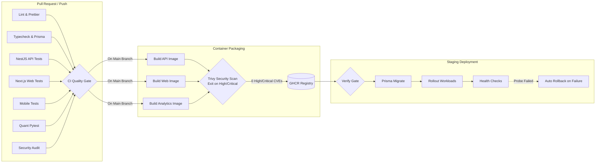

# Wealth Compass — Investor Portfolio Monitoring & Risk Management System

[](.github/workflows/ci.yml)
[](.github/workflows/build-docker.yml)
[](LICENSE)
[](https://www.typescriptlang.org/)
[](https://nestjs.com/)
[](https://nextjs.org/)
[](https://fastapi.tiangolo.com/)

An institutional-grade, multi-tenant financial aggregation, quantitative risk analytics, and portfolio monitoring platform engineered specifically for the **Indian Financial Ecosystem** (NSE/BSE, AMFI, RBI Account Aggregator).

---

## 🚀 Overview

Wealth Compass resolves financial fragmentation for retail and high-net-worth investors managing assets across disparate platforms (brokerages, mutual fund portals, banks, crypto exchanges, and real estate). It provides a unified command center delivering real-time net worth tracking, fixed-precision valuation, institutional risk metrics, and proactive alerting.

```
┌────────────────────────────────────────────────────────────────────────────────────────┐
│                              SYSTEM ARCHITECTURE OVERVIEW                              │
└────────────────────────────────────────────────────────────────────────────────────────┘
                                           │
             ┌─────────────────────────────┼─────────────────────────────┐
             ▼                             ▼                             ▼
   Next.js 14 Web Portal          React Native Expo App         REST API Clients / SDKs
   (Recharts Data Viz)            (iOS / Android)               (OpenAPI v3)
             │                             │                             │
             └─────────────────────────────┼─────────────────────────────┘
                                           │
                                           ▼
┌────────────────────────────────────────────────────────────────────────────────────────┐
│                        NestJS MODULAR MONOLITH GATEWAY                                 │
├────────────────────────────────────────────────────────────────────────────────────────┤
│ • Auth & RBAC (Argon2id + Dual JWT)       • Portfolio & Position Ledger (FIFO/Avg)     │
│ • Provider Ingestion (Zerodha, Groww)     • Valuation & Cash Flow Engine               │
│ • BullMQ Worker Scheduler                 • AES-256-GCM Cryptographic Service          │
│ • Structured Pino JSON Logging            • Prometheus Metrics Exporter                │
└────────────────────────────────────────────────────────────────────────────────────────┘
                    │                                          │
       ┌────────────┴────────────┐                ┌────────────┴────────────┐
       ▼                         ▼                ▼                         ▼
PostgreSQL 16 (TimescaleDB)    Redis 7 Cluster    Python 3.12 Quant Engine    AWS Cloud (Terraform)
• 14 Relational Models         • BullMQ Queues    • VaR (95% / 99%)           • ECS Fargate Services
• Decimal(18,8) Precision      • Multi-tier Cache • CVaR, Sharpe, Sortino     • Multi-AZ RDS & Redis
• FIFO Composite Indexes       • Invalidation     • Beta & Correlation Matrix • CloudFront Edge CDN
```

---

## ✨ Key Platform Capabilities

- **Multi-Broker Ingestion**: Seamless ingestion across Indian brokers (Zerodha, Groww, ICICI Direct), crypto exchanges (Binance, WazirX), and CSV statements with zero-leak credential storage.
- **Deterministic Valuation**: Fixed-precision `Decimal(18,8)` financial arithmetic eliminating floating-point inaccuracies. Implements both FIFO and Weighted Average cost lot tracking.
- **Institutional Risk Engine**: High-performance Python microservice calculating Time-Weighted Return (TWR), XIRR, Annualized Volatility, Sharpe Ratio, Sortino Ratio, CAPM Beta, and Historical Value-at-Risk (VaR / CVaR).
- **Concentration & Diversification**: Real-time Herfindahl-Hirschman Index (HHI) concentration tracking and correlation-weighted diversification scoring.
- **Proactive Alerts & Cooldowns**: Configurable rule engine for portfolio drawdown limits, volatility spikes, and asset maturity with 24-hour notification cooldowns across in-app, email, and webhooks.
- **Executive Reporting**: High-fidelity asynchronous PDF generation and RFC 4180 compliant CSV exports across 5 financial report types.
- **Enterprise Security**: Argon2id password hashing, AES-256-GCM encryption at rest, strict tenant isolation, and zero-sensitive-data logging interceptors.
- **Production Observability**: Structured Pino logging with trace context correlation, Prometheus metrics exporter (`wealthcompass_*`), deep 3-tier health probes, and pre-built Grafana dashboards.

---

## 🛠️ Technology Matrix

| Layer                   | Technologies                                                                                                                                                               |
| :---------------------- | :------------------------------------------------------------------------------------------------------------------------------------------------------------------------- |
| **Monorepo Engine**     | [Turborepo](https://turbo.build/) v2.0, [pnpm](https://pnpm.io/) Workspaces                                                                                                |
| **Backend API**         | [NestJS](https://nestjs.com/) v10, TypeScript 5.7, Node.js 20 LTS                                                                                                          |
| **Database & Cache**    | PostgreSQL 16 ([TimescaleDB](https://www.timescale.com/)), [Prisma ORM](https://www.prisma.io/) v5.22, [Redis](https://redis.io/) 7                                        |
| **Job Queue**           | [BullMQ](https://bullmq.io/) v6 over Redis                                                                                                                                 |
| **Quantitative Engine** | Python 3.12, [FastAPI](https://fastapi.tiangolo.com/), [NumPy](https://numpy.org/), [SciPy](https://scipy.org/), [pandas](https://pandas.pydata.org/)                      |
| **Web Frontend**        | [Next.js](https://nextjs.org/) 14 (App Router), React 18, [Tailwind CSS](https://tailwindcss.com/), [Shadcn UI](https://ui.shadcn.com/), [Recharts](https://recharts.org/) |
| **Mobile App**          | [React Native](https://reactnative.dev/), [Expo](https://expo.dev/) SDK 52, NativeWind v4                                                                                  |
| **Cloud & IaC**         | [Terraform](https://www.terraform.io/) AWS Modules (VPC, ECS Fargate, RDS Multi-AZ, ElastiCache, ALB, CloudFront)                                                          |
| **Observability**       | Pino, [Prometheus](https://prometheus.io/) (`prom-client`), [OpenTelemetry](https://opentelemetry.io/), [Grafana](https://grafana.com/), Sentry                            |

---

## 🚀 Quick Start (3-Command Boot)

A new developer can boot the full development environment with exactly **three commands**:

```bash
# 1. Install dependencies across all monorepo packages
pnpm install

# 2. Boot backing services (PostgreSQL 16 TimescaleDB & Redis 7)
docker-compose up -d

# 3. Launch full monorepo development stack (API, Web, and Workers)
pnpm dev
```

### Accessing Running Services

- **Web Dashboard:** [http://localhost:3000](http://localhost:3000)
- **API Server & Swagger Docs:** [http://localhost:3000/api/docs](http://localhost:3000/api/docs)
- **Deep Readiness Health Probe:** [http://localhost:3000/health/readiness](http://localhost:3000/health/readiness)
- **Prometheus Metrics:** [http://localhost:3000/metrics](http://localhost:3000/metrics)
- **PostgreSQL Adminer UI:** [http://localhost:8080](http://localhost:8080) (Server: `postgres`, User: `postgres`, Password: `postgres_dev_password_only`)

For detailed environment options, database migration commands, and troubleshooting, consult the [Developer Setup Guide](docs/SETUP_GUIDE.md).

---

## 📚 Living Documentation Suite

Wealth Compass maintains enterprise living documentation covering every operational and architectural aspect of the platform:

| Document                        | Path                                                                                     | Purpose                                                                                           |
| :------------------------------ | :--------------------------------------------------------------------------------------- | :------------------------------------------------------------------------------------------------ |
| **Developer Setup Guide**       | [`docs/SETUP_GUIDE.md`](docs/SETUP_GUIDE.md)                                             | Exhaustive workstation setup, `.env` parameter dictionary, and dev workflows.                     |
| **Troubleshooting Runbook**     | [`docs/TROUBLESHOOTING.md`](docs/TROUBLESHOOTING.md)                                     | Diagnostic runbooks for containers, migrations, queues, and numerical solvers.                    |
| **Master Data Dictionary**      | [`docs/DATA_DICTIONARY.md`](docs/DATA_DICTIONARY.md)                                     | Authoritative reference for all 14 models, column data types, precision, and enums.               |
| **System Architecture**         | [`docs/architecture/ARCHITECTURE.md`](docs/architecture/ARCHITECTURE.md)                 | Complete C4 model, bounded contexts, queue topology, and security boundaries.                     |
| **REST API Contract**           | [`API_CONTRACT.md`](API_CONTRACT.md)                                                     | Full endpoint contracts, request/response envelopes, pagination, and error codes.                 |
| **Database Specification**      | [`DATABASE.md`](DATABASE.md)                                                             | PostgreSQL relational ERD, indexing strategies, and migration policies.                           |
| **Cloud Deployment & IaC**      | [`docs/deployment/CLOUD_DEPLOYMENT.md`](docs/deployment/CLOUD_DEPLOYMENT.md)             | AWS ECS Fargate, RDS, ElastiCache, S3, ALB, and CloudFront Terraform manual.                      |
| **Platform Observability**      | [`docs/operations/OBSERVABILITY.md`](docs/operations/OBSERVABILITY.md)                   | Telemetry architecture, metrics dictionary, readiness probes, and Grafana guides.                 |
| **Security Audit Report**       | [`docs/security/SECURITY_AUDIT.md`](docs/security/SECURITY_AUDIT.md)                     | OWASP Top 10 evaluation, AES-256-GCM implementation, and IDOR mitigation.                         |
| **Performance Benchmarks**      | [`docs/performance/BENCHMARK_RESULTS.md`](docs/performance/BENCHMARK_RESULTS.md)         | K6 load test certification (1,000 VUs, p95 2.03ms, zero failures).                                |
| **Analytics Methodology**       | [`docs/analytics/ANALYTICS_METHODOLOGY.md`](docs/analytics/ANALYTICS_METHODOLOGY.md)     | Mathematical specifications for TWR, Modified Dietz, and XIRR solvers.                            |
| **Risk Methodology**            | [`docs/analytics/RISK_METHODOLOGY.md`](docs/analytics/RISK_METHODOLOGY.md)               | Mathematical formulations for VaR, CVaR, Sharpe, Sortino, and Volatility.                         |
| **Production Readiness Review** | [`docs/audit/PRODUCTION_READINESS_REVIEW.md`](docs/audit/PRODUCTION_READINESS_REVIEW.md) | Formal production audit, quality gates certification, and commercial launch sign-off.             |
| **Technical Debt Backlog**      | [`docs/audit/TECHNICAL_DEBT.md`](docs/audit/TECHNICAL_DEBT.md)                           | Transparent disclosure of architectural trade-offs, numerical limitations, and v1.1/v2.0 roadmap. |

---

## 🧪 Automated Testing & Verification

Wealth Compass enforces an institutional testing pyramid with over 740 automated tests:

```bash
# Execute the unified monorepo test orchestrator (All 4 testing tiers)
pnpm test:all

# Run backend API Jest test suites (346 tests)
pnpm --filter @investor-pm/api test

# Run frontend Vitest component tests (46 tests)
pnpm --filter @investor-pm/web test

# Run Python quantitative benchmark pytest suite (363 tests)
cd apps/quant-engine && pytest

# Run headless Playwright E2E user journeys (18 specs)
pnpm --filter @investor-pm/web test:e2e
```

---

## 🔄 CI/CD Automation & Build Pipelines

DevOps automation is enforced via three parallel GitHub Actions pipelines:



1. **Continuous Integration (`.github/workflows/ci.yml`)**: Parallel execution of 7 verification jobs keeping merge feedback under 3 minutes with automated pnpm store caching.
2. **Container Build & Security Scanning (`.github/workflows/build-docker.yml`)**: Multi-stage Docker builds with Docker layer caching and automated Trivy vulnerability scanning blocking high/critical CVEs.
3. **Staging Deployment (`.github/workflows/deploy-staging.yml`)**: Automated schema migrations (`prisma migrate deploy`), ECS rolling updates, and synthetic health probe verification with automated rollback.

---

## 📄 License

This project is licensed under the MIT License. See [LICENSE](LICENSE) for details.
