# System Architecture Document
## Investor Portfolio Monitoring & Risk Management System

---

| Metadata           | Value                                                                    |
|--------------------|--------------------------------------------------------------------------|
| **Document ID**    | SA-001                                                                   |
| **Version**        | 1.0.0                                                                    |
| **Phase**          | Phase 3 — System Architecture & Technical Design                         |
| **Status**         | Approved for Phase 4                                                     |
| **Author(s)**      | Principal Architecture Team                                              |
| **Created**        | 2026-08-13                                                               |
| **Last Updated**   | 2026-08-13                                                               |
| **Depends On**     | PD-001 (Product Discovery), PRD-001 (Product Requirements)               |

---

## Table of Contents

1. [System Overview & Architectural Philosophy](#1-system-overview--architectural-philosophy)
2. [Technology Stack Decisions](#2-technology-stack-decisions)
3. [C4 Architecture Diagrams](#3-c4-architecture-diagrams)
   - [3.1 Level 1 — System Context Diagram](#31-level-1--system-context-diagram)
   - [3.2 Level 2 — Container Diagram](#32-level-2--container-diagram)
   - [3.3 Level 3 — Component Diagram (NestJS API)](#33-level-3--component-diagram-nestjs-api)
   - [3.4 Level 3 — Component Diagram (Python Quant Engine)](#34-level-3--component-diagram-python-quant-engine)
4. [Bounded Context Map](#4-bounded-context-map)
5. [Data Flow Pipeline Architecture](#5-data-flow-pipeline-architecture)
   - [5.1 End-to-End Pipeline Overview](#51-end-to-end-pipeline-overview)
   - [5.2 Stage 1 — Raw Data Ingestion](#52-stage-1--raw-data-ingestion)
   - [5.3 Stage 2 — Normalisation](#53-stage-2--normalisation)
   - [5.4 Stage 3 — Persistence](#54-stage-3--persistence)
   - [5.5 Stage 4 — Calculation](#55-stage-4--calculation)
   - [5.6 Stage 5 — Analytics](#56-stage-5--analytics)
   - [5.7 Stage 6 — Insights & Alerting](#57-stage-6--insights--alerting)
6. [Synchronous vs. Asynchronous Workflow Design](#6-synchronous-vs-asynchronous-workflow-design)
   - [6.1 Synchronous REST/OpenAPI Flows](#61-synchronous-restopenapi-flows)
   - [6.2 Asynchronous BullMQ Queue Flows](#62-asynchronous-bullmq-queue-flows)
   - [6.3 Queue Topology](#63-queue-topology)
7. [Security & Isolation Boundaries](#7-security--isolation-boundaries)
8. [Infrastructure & Deployment Topology](#8-infrastructure--deployment-topology)
9. [Inter-Service Communication Contracts](#9-inter-service-communication-contracts)
10. [Observability Architecture](#10-observability-architecture)
11. [Architecture Decision Records (ADR) Summary](#11-architecture-decision-records-adr-summary)
12. [Open Questions Resolved](#12-open-questions-resolved)

---

## 1. System Overview & Architectural Philosophy

### 1.1 Guiding Principles

| Principle | Application |
|-----------|-------------|
| **Domain-Driven Design (DDD)** | Business logic is partitioned into bounded contexts aligned to PRD Epics |
| **Separation of Concerns** | Transactional business logic (NestJS) is strictly isolated from compute-intensive quant calculations (Python FastAPI) |
| **Async-First for I/O-Bound Work** | All external provider syncs and report generation are executed as background BullMQ jobs; no user-facing request blocks on I/O |
| **Read-Only External Access** | System never acquires write/trade permissions on any financial provider (D-002) |
| **Defence in Depth** | Multiple layers of security: network boundary, service-level auth, field-level encryption |
| **Graceful Degradation** | Price feed failures serve stale data with freshness indicators; quant engine unavailability falls back to last computed metrics |
| **Observability by Design** | OpenTelemetry instrumentation at every service boundary from day one |

### 1.2 Architectural Pattern: Modular Monolith + Quant Microservice

```
+------------------------------------------------------------------+
|               MODULAR MONOLITH  (NestJS / Node.js)              |
|                                                                  |
|  +---------+  +---------+  +---------+  +---------+  +-------+  |
|  |  Auth   |  |Ingest.  |  |Valuat.  |  |  Alert  |  |Report |  |
|  | Context |  | Context |  | Context |  | Context |  |Context|  |
|  +---------+  +---------+  +---------+  +---------+  +-------+  |
|                   | Internal Domain Events (in-process)         |
|             +-----+-------------------------------------+        |
|             |    Shared Kernel (Core Domain)            |        |
|             +-------------------------------------------+        |
+----------------------------+-------------------------------------+
                             | REST/HTTP  (internal network only)
                             v
+------------------------------------------------------------------+
|          QUANT MICROSERVICE  (Python FastAPI)                    |
|                                                                  |
|  VaR Engine | Sharpe/Sortino | Beta/Correlation | XIRR | Scenario|
+------------------------------------------------------------------+
```

**Rationale for Modular Monolith (NestJS):**
- All business contexts share a single PostgreSQL transactional boundary — avoids distributed transaction complexity
- NestJS module system enforces strict domain isolation via module boundaries and barrel exports
- Simpler operational model for MVP and V1.0; modules can be extracted to independent microservices in V2.0+ if needed
- Single deployment unit reduces latency and infrastructure cost at early scale

**Rationale for Python Quant Microservice:**
- NumPy/Pandas/SciPy/QuantLib are the de-facto standard for financial matrix computations
- VaR (Historical Simulation), Sharpe Ratio, correlation matrices, and XIRR require vectorised operations not idiomatic in Node.js
- Horizontal scaling of the CPU-intensive quant tier is independent from the I/O-bound API tier
- Clear language boundary prevents cognitive overload in a single codebase

---

## 2. Technology Stack Decisions

> Resolves all Phase 2 Open Questions (OQ-006 through OQ-010).

| Layer | Technology | Version | Decision Rationale |
|-------|-----------|---------|-------------------|
| **API Framework** | NestJS (Node.js) | 10.x | TypeScript-native, module-based, OpenAPI support, BullMQ integration |
| **Quant Engine** | Python FastAPI | 0.111.x | Async, OpenAPI-native, ideal for CPU-bound compute endpoints |
| **Primary Database** | PostgreSQL | 16.x | ACID compliance, JSONB support, strong ecosystem |
| **Time-Series DB** | TimescaleDB (PostgreSQL extension) | 2.x | Optimised hypertables for price tick storage; same connection pool |
| **Cache / PubSub** | Redis | 7.x | BullMQ backing store; price cache; PubSub for real-time price events |
| **Job Queue** | BullMQ (over Redis) | 5.x | Priority queues, retries, rate limiting, cron scheduling — native TypeScript |
| **Message Broker** | Redis PubSub (internal events) + BullMQ Queues (job dispatch) | — | Avoids Kafka/RabbitMQ operational overhead at MVP scale |
| **Secret Management** | HashiCorp Vault | 1.16.x | TOTP secrets, API keys, OAuth tokens — HSM-backed KMS wrap |
| **TOTP Storage** | HashiCorp Vault (Encrypted KV) | — | TOTP secrets never touch application DB; stored in Vault KV v2 |
| **PDF Generation** | Puppeteer (headless Chromium) | latest | Pixel-perfect layouts, full CSS support, chart screenshot capability |
| **Auth** | Passport.js + JWT + TOTP (otplib) | — | Industry standard; TOTP via RFC 6238-compliant otplib |
| **ORM** | TypeORM | 0.3.x | TypeScript decorators, migration support, PostgreSQL-optimised |
| **API Spec** | OpenAPI 3.1 | — | Generated from NestJS decorators via @nestjs/swagger |
| **Frontend** | Next.js 14 (App Router) | 14.x | SSR for SEO; RSC for performance; React ecosystem |
| **Mobile** | React Native (V1.0) | — | Code reuse with web; large ecosystem |
| **Quant Libraries** | NumPy, Pandas, SciPy, QuantLib-Python | — | VaR/CVaR, Sharpe, Beta, Sortino, XIRR, Monte Carlo |
| **Container Runtime** | Docker + Docker Compose (dev) / Kubernetes (prod) | — | Standard container orchestration |
| **CI/CD** | GitHub Actions | — | Native OIDC, matrix builds, Docker layer caching |

---

## 3. C4 Architecture Diagrams

### 3.1 Level 1 — System Context Diagram

> Describes who uses the system and what external systems it depends on.

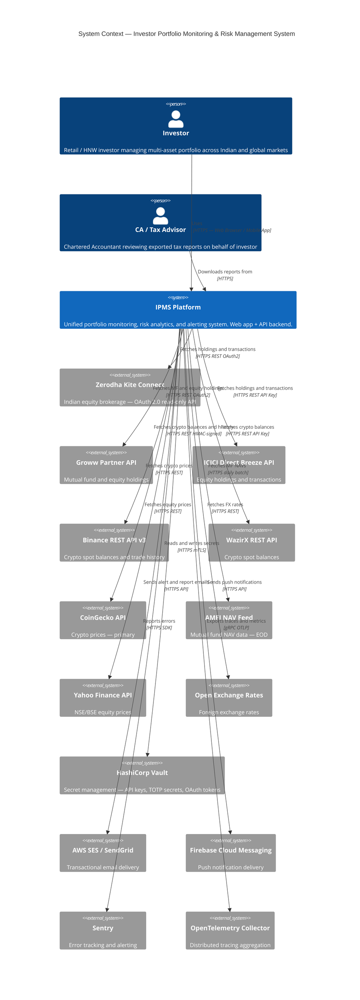

---

### 3.2 Level 2 — Container Diagram

> Describes the major deployable units (containers) within the IPMS platform.

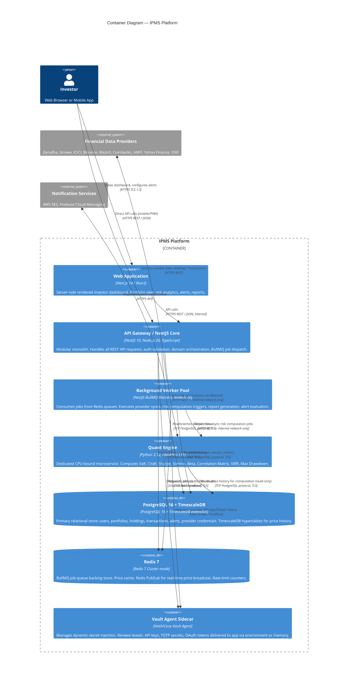

---

### 3.3 Level 3 — Component Diagram (NestJS API Modular Monolith)

> Describes the modules (bounded contexts) within the NestJS API gateway container.

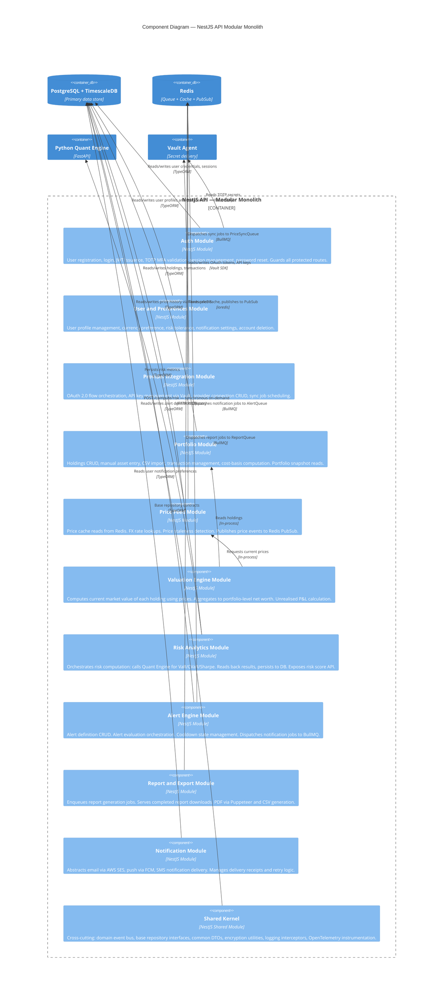

---

### 3.4 Level 3 — Component Diagram (Python Quant Engine)

> Describes the internal computation modules of the Python FastAPI microservice.

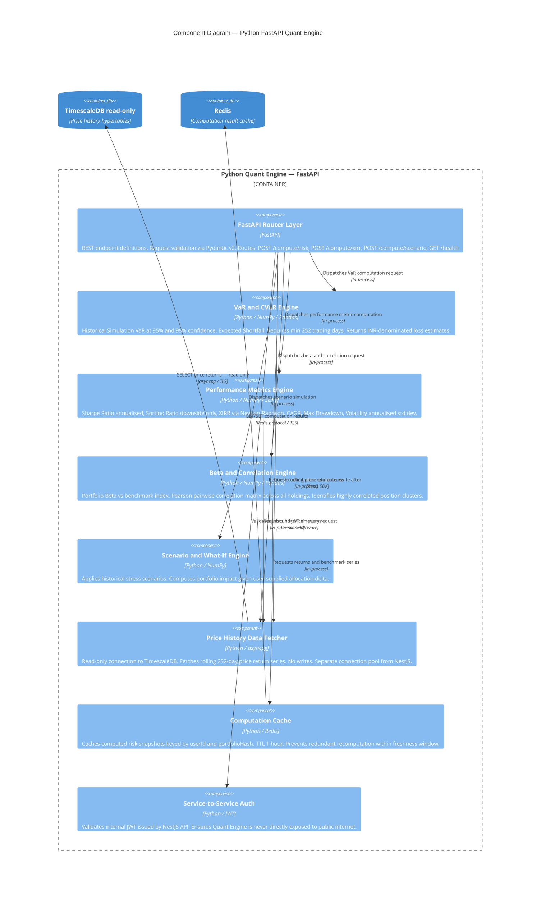

---

## 4. Bounded Context Map

> Maps the six strategic bounded contexts of the system, their ownership, and cross-context relationships.

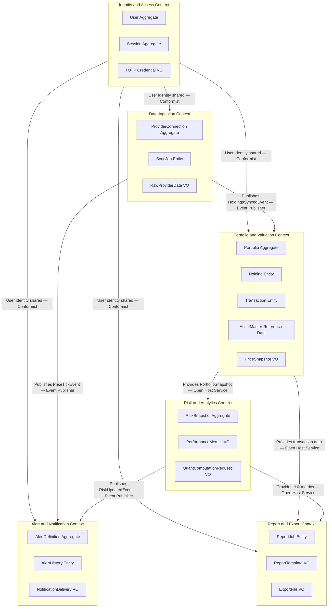

### 4.1 Context Relationship Patterns

| Relationship | Pattern | Description |
|---|---|---|
| Auth → All other contexts | **Shared Kernel (Conformist)** | `UserId` and `UserPreferences` are a shared type. Other contexts accept Auth's model. |
| Ingestion → Portfolio | **Event-Published (Downstream)** | Ingestion publishes `HoldingsSyncedEvent`; Portfolio context consumes and applies to holdings. |
| Ingestion → Alert | **Event-Published (Downstream)** | Alert engine subscribes to `PriceTickEvent` via Redis PubSub for real-time price alert evaluation. |
| Portfolio → Risk | **Open Host Service** | Portfolio exposes a well-defined `PortfolioSnapshot` read model consumed by Risk context. |
| Portfolio → Report | **Open Host Service** | Report context reads holdings and transactions via Portfolio's published read model. |
| Risk → Alert | **Event-Published (Downstream)** | Risk publishes `RiskMetricsUpdatedEvent`; Alert engine evaluates risk score change alerts. |
| Risk → Report | **Open Host Service** | Report context reads latest risk snapshot for inclusion in generated reports. |

### 4.2 Anti-Corruption Layers

| Boundary | ACL Location | Purpose |
|---|---|---|
| External Provider APIs → Ingestion Context | `ProviderAdapterFactory` in Ingestion module | Translates provider-specific DTOs into canonical `RawHolding` domain objects |
| CoinGecko API → Price Feed | `CoinGeckoPriceAdapter` | Maps CoinGecko response to canonical `CryptoPrice` value object |
| AMFI NAV Feed → Price Feed | `AmfiNavParser` | Parses AMFI pipe-delimited text into canonical `MFNav` value object |
| Python Quant Engine → Risk Context | `QuantEngineGateway` in Risk module | Translates `PortfolioSnapshot` to Quant Engine request DTO; maps response to `RiskSnapshot` |

---

## 5. Data Flow Pipeline Architecture

### 5.1 End-to-End Pipeline Overview

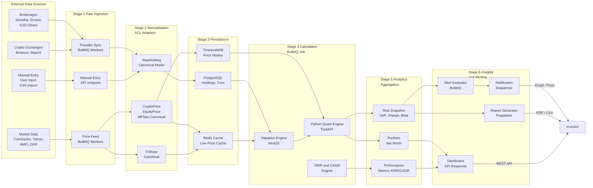

---

### 5.2 Stage 1 — Raw Data Ingestion

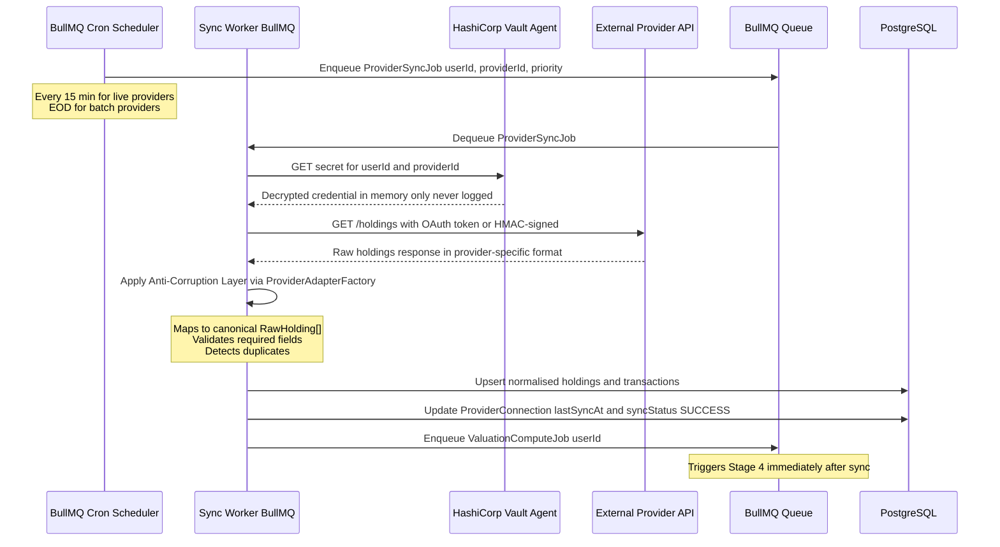

**Ingestion Rate Limiting:**

| Provider | Max Rate | Strategy |
|---|---|---|
| Zerodha Kite Connect | 3 req/sec | Token bucket rate limiter in BullMQ limiter config |
| Binance REST API | 1200 req/min weight | Weight-aware request scheduler |
| CoinGecko Free Tier | 10–30 calls/min | Per-minute BullMQ rate limiter |
| AMFI NAV Feed | 1x/day | EOD cron job at 21:30 IST |
| Yahoo Finance | ~2000 req/hr | Bulk symbol batching (max 100 symbols/request) |

---

### 5.3 Stage 2 — Normalisation

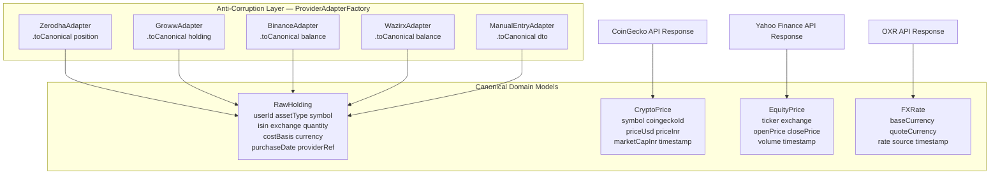

**Normalisation rules:**
- All quantities stored as `DECIMAL(20, 8)` — supports fractional crypto at satoshi-level precision
- All monetary amounts stored in original currency with FX rate snapshot at time of ingestion
- Cost basis stored per transaction; aggregated cost basis computed at query time using user's preferred method (FIFO/LIFO/Avg)
- Timestamps normalised to UTC ISO-8601 with millisecond precision

---

### 5.4 Stage 3 — Persistence

**Database Schema (simplified ERD):**

```
USERS
  id (uuid PK)
  email (varchar UK, encrypted)
  password_hash (bcrypt)
  phone_encrypted (varchar)
  status (enum)
  created_at (timestamp)

USER_PREFERENCES
  id (uuid PK)
  user_id (uuid FK -> USERS)
  home_currency (char 3)
  risk_tolerance (enum)
  timezone (varchar)
  notification_settings (jsonb)

PROVIDER_CONNECTIONS
  id (uuid PK)
  user_id (uuid FK -> USERS)
  provider_code (varchar)
  vault_secret_path (varchar)
  status (enum)
  last_sync_at (timestamp)
  last_sync_status (enum)

HOLDINGS
  id (uuid PK)
  user_id (uuid FK -> USERS)
  provider_connection_id (uuid FK nullable)
  asset_type (varchar)
  symbol (varchar)
  isin (varchar nullable)
  quantity (DECIMAL 20,8)
  avg_cost_basis (DECIMAL 20,8)
  cost_currency (char 3)
  cost_basis_method (enum FIFO/LIFO/AVG)
  is_manual (boolean)
  updated_at (timestamp)

TRANSACTIONS
  id (uuid PK)
  holding_id (uuid FK -> HOLDINGS)
  user_id (uuid FK -> USERS)
  type (enum BUY/SELL/DIVIDEND/SPLIT/BONUS)
  quantity (DECIMAL 20,8)
  price_per_unit (DECIMAL 20,8)
  currency (char 3)
  fx_rate_to_home (DECIMAL 10,6)
  transacted_at (timestamp)
  provider_ref_id (varchar)

RISK_SNAPSHOTS
  id (uuid PK)
  user_id (uuid FK -> USERS)
  var_95_1d (DECIMAL 20,2)
  cvar_95_1d (DECIMAL 20,2)
  sharpe_ratio (DECIMAL 10,4)
  sortino_ratio (DECIMAL 10,4)
  beta (DECIMAL 10,4)
  max_drawdown (DECIMAL 10,4)
  volatility_annual (DECIMAL 10,4)
  portfolio_risk_score (integer 0-100)
  concentration_risk (jsonb)
  correlation_matrix (jsonb)
  computed_at (timestamp)
  price_history_days_used (integer)

ALERT_DEFINITIONS
  id (uuid PK)
  user_id (uuid FK -> USERS)
  name (varchar)
  alert_type (enum)
  condition (jsonb)
  channels (jsonb)
  is_active (boolean)
  cooldown_duration (interval)
  last_triggered_at (timestamp)

ALERT_HISTORY
  id (uuid PK)
  alert_id (uuid FK -> ALERT_DEFINITIONS)
  triggered_at (timestamp)
  delivered_at (timestamp)
  delivery_status (enum)
  triggered_values (jsonb)

-- TimescaleDB Hypertables (partitioned by time):
EQUITY_PRICES (ticker, exchange, close_price, open_price, volume, price_time)
CRYPTO_PRICES (symbol, price_usd, price_inr, market_cap_inr, price_time)
MF_NAVS (isin, nav, nav_date, ingested_at)
FX_RATES (base_currency, quote_currency, rate, source, rate_time)
```

**TimescaleDB Configuration:**
- `equity_prices`, `crypto_prices`, `fx_rates` partitioned as hypertables by time column (7-day chunks)
- Continuous aggregates for OHLCV 1-hour and 1-day rollups
- Compression policy: chunks older than 90 days automatically compressed
- Retention policy: raw tick data retained 2 years; daily aggregates retained 10 years

---

### 5.5 Stage 4 — Calculation

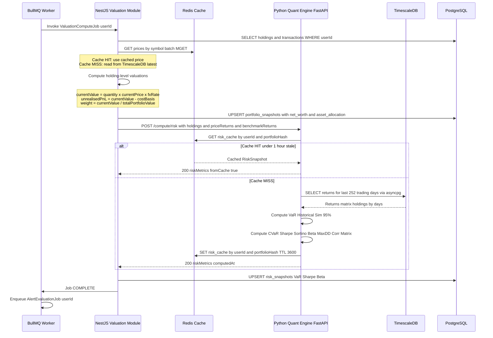

---

### 5.6 Stage 5 — Analytics

The analytics layer aggregates computed outputs into read-model projections optimised for API response:

| Read Model | Populated From | Key Fields |
|---|---|---|
| `PortfolioDashboardView` | ValuationEngine outputs | totalNetWorth, assetAllocation[], topGainers[], topLosers[], dailyChangeAbs, dailyChangePct, lastUpdatedAt |
| `RiskDashboardView` | RiskSnapshot (PostgreSQL) | riskScore 0-100, var95_1d_inr, sharpeRatio, beta, maxDrawdown, concentrationRisk[], correlationMatrix[][] |
| `PerformanceView` | Performance metrics computed on request | xirr, cagr, absoluteReturn, realisedGainLoss, unrealisedGainLoss, dividendIncome, benchmarkComparison[] |
| `HoldingDetailView` | ValuationEngine + TransactionEngine | currentPrice, priceChange1D, costBasis, avgCostPerUnit, unrealisedPnL, portfolioWeight, xirr holding-level |

---

### 5.7 Stage 6 — Insights & Alerting

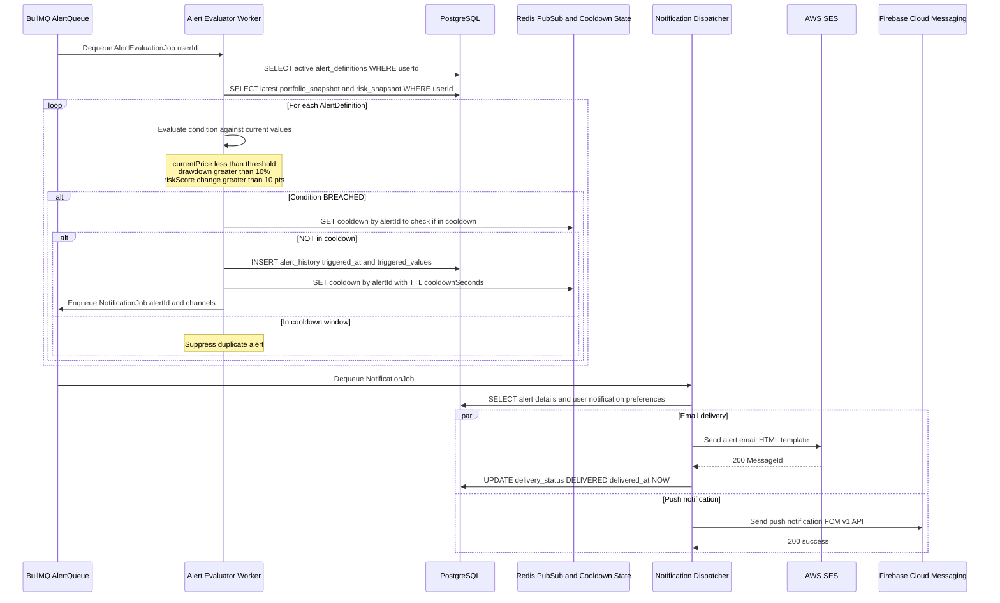

---

## 6. Synchronous vs. Asynchronous Workflow Design

### 6.1 Synchronous REST/OpenAPI Flows

> Used when the user is waiting for a response — must complete within SLA.

| Endpoint | Module | Max Latency | What It Does |
|---|---|---|---|
| `POST /auth/login` | Auth | < 300ms | Validates credentials, issues JWT. No I/O beyond DB read. |
| `GET /portfolio/dashboard` | Portfolio + Valuation | < 200ms | Reads materialised portfolio snapshot from PostgreSQL. No live computation. |
| `GET /portfolio/holdings/:id` | Portfolio | < 100ms | Single holding detail read. Joins latest price from Redis cache. |
| `GET /risk/snapshot` | Risk | < 200ms | Reads latest persisted risk snapshot. Does NOT trigger computation. |
| `POST /risk/refresh` | Risk | < 1000ms | Triggers synchronous call to Quant Engine only if no fresh snapshot (< 1hr) exists in cache. |
| `GET /alerts` | Alert | < 100ms | Lists user's alert definitions from DB. |
| `POST /alerts` | Alert | < 200ms | Creates new alert definition. Returns immediately. |
| `GET /providers` | Provider | < 100ms | Lists connected provider statuses with last sync timestamps. |
| `POST /providers/:id/sync` | Provider | < 500ms | Validates provider, **enqueues** a sync job, returns `{ jobId }`. Does NOT wait for sync. |
| `POST /reports/generate` | Report | < 300ms | Validates params, **enqueues** report generation job, returns `{ jobId }`. |
| `GET /reports/:jobId/status` | Report | < 100ms | Polls job status. Returns download URL when COMPLETE. |

> **Critical Rule:** No synchronous API endpoint performs external HTTP calls to financial providers. All provider I/O is exclusively asynchronous via BullMQ.

---

### 6.2 Asynchronous BullMQ Queue Flows

> Used for all I/O-heavy, long-running, or background operations.

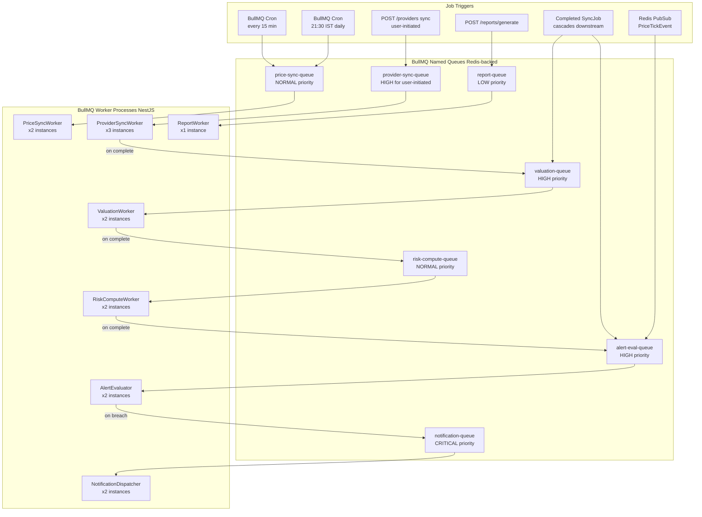

---

### 6.3 Queue Topology

| Queue Name | Priority | Concurrency | Retry Policy | Rate Limit | Purpose |
|---|---|---|---|---|---|
| `price-sync-queue` | NORMAL | 5 | 3 retries, exp backoff (2^n x 1s) | Per-provider rate limit | Fetches live prices from CoinGecko, Yahoo, AMFI |
| `provider-sync-queue` | HIGH (user) / LOW (cron) | 3 | 3 retries, exp backoff (2^n x 5s) | 1 sync/user/provider/15min | Syncs holdings from brokerages and exchanges |
| `valuation-queue` | HIGH | 5 | 2 retries | None | Recomputes net worth and holding valuations |
| `risk-compute-queue` | NORMAL | 3 | 2 retries, fixed 10s delay | 1/user/hour (dedup by jobId) | Calls Python Quant Engine for full risk metrics |
| `alert-eval-queue` | HIGH | 10 | 1 retry | None | Evaluates all active alerts against latest portfolio data |
| `report-queue` | LOW | 1 | 1 retry | None | Generates PDF/CSV reports via Puppeteer |
| `notification-queue` | CRITICAL | 5 | 5 retries, exp backoff | Per-channel rate limit | Dispatches emails, push notifications, SMS |

**Job Deduplication:** `risk-compute-queue` uses BullMQ's `jobId` deduplication keyed by `userId`. A new risk computation job for the same user is dropped if one is already pending or processing, preventing queue flooding on rapid consecutive syncs.

---

## 7. Security & Isolation Boundaries

### 7.1 Network Boundary Architecture

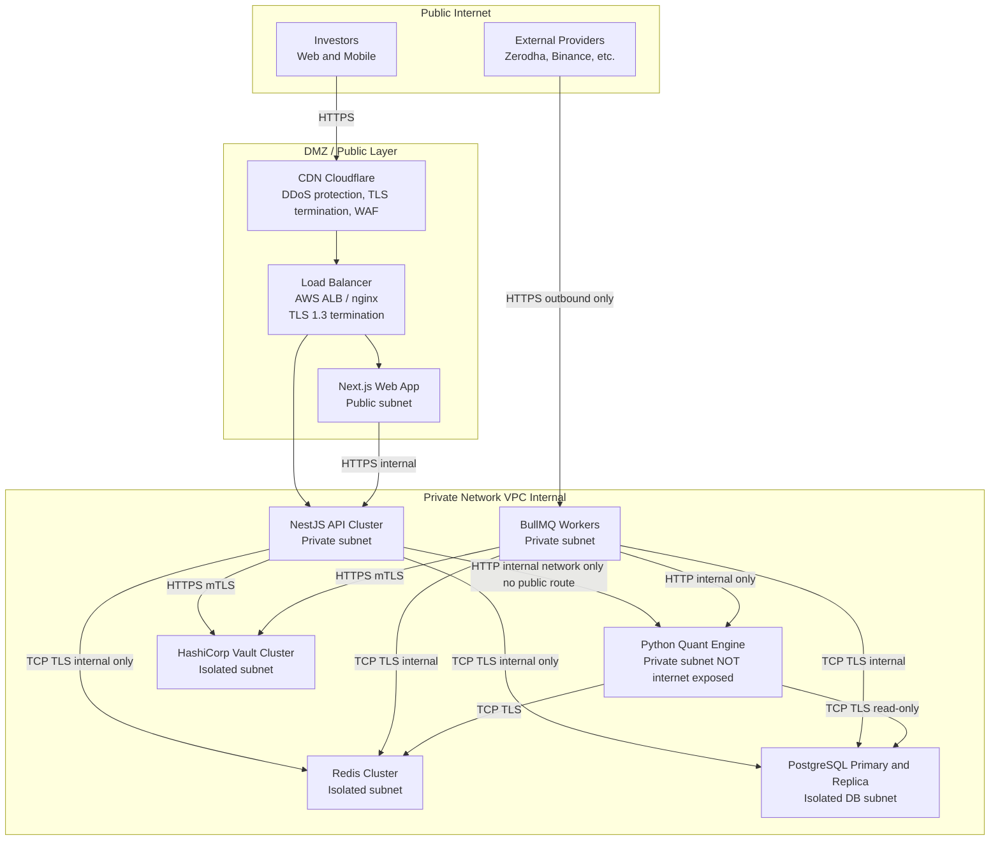

> **Critical Rule:** The Python Quant Engine has **zero public internet exposure**. It accepts connections only from the NestJS API and BullMQ Workers within the private VPC subnet. No external IP or port exists for the Quant Engine.

---

### 7.2 Authentication & Authorisation Architecture

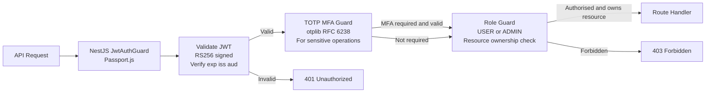

**Service-to-Service Auth (NestJS to Python Quant Engine):**
- NestJS issues a short-lived internal JWT (RS256, 5-minute TTL, `aud: quant-engine`) on each request
- Python Quant Engine validates this JWT using the shared public key
- No API key or basic auth — cryptographic verification prevents spoofing

### 7.3 Encryption Strategy

| Data Category | At Rest | In Transit | Key Management |
|---|---|---|---|
| User passwords | bcrypt (cost 12) — never stored plaintext | N/A | N/A |
| OAuth refresh tokens | AES-256-GCM via Vault KV v2 | TLS 1.3 | Vault-managed, auto-rotated 90-day |
| Provider API keys | AES-256-GCM via Vault KV v2 | TLS 1.3 | Vault-managed, auto-rotated 90-day |
| TOTP secrets | Vault KV v2 (dedicated path) | TLS 1.3 + mTLS | Vault-managed |
| User PII (email, phone) | AES-256-GCM field-level encryption | TLS 1.3 | Application-level KMS-backed key |
| Portfolio data | PostgreSQL TDE | TLS 1.3 | Cloud KMS (AWS KMS or GCP KMS) |
| Price history | TimescaleDB encrypted tablespace | TLS 1.3 | Cloud KMS |
| Redis data | Redis AUTH + TLS | TLS 1.3 | Cloud KMS for persistence encryption |

### 7.4 OWASP Top 10 Controls

| OWASP Risk | Control Implemented |
|---|---|
| A01 Broken Access Control | Resource ownership enforced in every repository query (`WHERE user_id = :userId`). RBAC guards on sensitive endpoints. |
| A02 Cryptographic Failures | AES-256-GCM for all secrets. bcrypt for passwords. TLS 1.3 everywhere. No MD5/SHA1. |
| A03 Injection | TypeORM parameterised queries everywhere. No raw SQL concatenation. Input validated with class-validator DTOs. |
| A04 Insecure Design | Read-only API principle (D-002). No write access to any brokerage. |
| A05 Security Misconfiguration | Infrastructure as Code (Terraform). Secrets in Vault, never in env files. Docker security scanning via Trivy. |
| A06 Vulnerable Components | Snyk and Dependabot weekly scans. Automated PR for dependency updates. |
| A07 Auth Failures | JWT RS256. TOTP MFA. Max login attempts (5) with exponential lockout. OTP expiry 5 minutes. |
| A08 Software Integrity | SBOM generated at each build. Docker image signing via cosign. |
| A09 Logging Failures | All auth events, data access, and API errors logged to ELK. No PII in logs. Correlation IDs on every request. |
| A10 SSRF | All outbound HTTP calls restricted to allowlisted provider domains. No user-supplied URLs followed. |

---

## 8. Infrastructure & Deployment Topology

### 8.1 Monorepo Structure

```
investor-portfolio-system/
├── apps/
│   ├── api/                     # NestJS Modular Monolith
│   │   ├── src/
│   │   │   ├── auth/            # Auth bounded context
│   │   │   ├── users/           # User and Preferences context
│   │   │   ├── providers/       # Data Ingestion context
│   │   │   ├── portfolio/       # Portfolio and Valuation context
│   │   │   ├── risk/            # Risk Analytics context (orchestration)
│   │   │   ├── alerts/          # Alert Engine context
│   │   │   ├── reports/         # Report and Export context
│   │   │   ├── notifications/   # Notification delivery
│   │   │   ├── price-feed/      # Price feed cache and TimescaleDB reads
│   │   │   └── shared/          # Shared Kernel (events, base repos, utils)
│   │   └── Dockerfile
│   ├── workers/                 # BullMQ worker process (separate deployment)
│   │   ├── src/
│   │   │   ├── price-sync/
│   │   │   ├── provider-sync/
│   │   │   ├── valuation/
│   │   │   ├── risk-compute/
│   │   │   ├── alert-eval/
│   │   │   ├── report-gen/
│   │   │   └── notification/
│   │   └── Dockerfile
│   ├── quant-engine/            # Python FastAPI Quant Microservice
│   │   ├── app/
│   │   │   ├── routers/         # FastAPI route definitions
│   │   │   ├── engines/         # VaR, Sharpe, Beta, XIRR engines
│   │   │   ├── adapters/        # asyncpg DB adapter (read-only)
│   │   │   ├── cache/           # Redis cache layer
│   │   │   └── auth/            # JWT guard middleware
│   │   ├── requirements.txt
│   │   └── Dockerfile
│   └── web/                     # Next.js 14 Frontend
│       ├── app/                 # App Router pages
│       ├── components/
│       └── Dockerfile
├── packages/
│   ├── shared-types/            # Canonical TypeScript DTOs shared between api and web
│   ├── ui-components/           # Shared React component library
│   └── config/                  # Shared ESLint, TypeScript, Jest configs
├── infra/
│   ├── terraform/               # Infrastructure as Code
│   ├── k8s/                     # Kubernetes manifests
│   └── docker-compose.yml       # Local development full-stack
└── docs/
    ├── architecture/
    ├── api/
    ├── adr/
    └── product/
```

### 8.2 Kubernetes Deployment Architecture (Production)

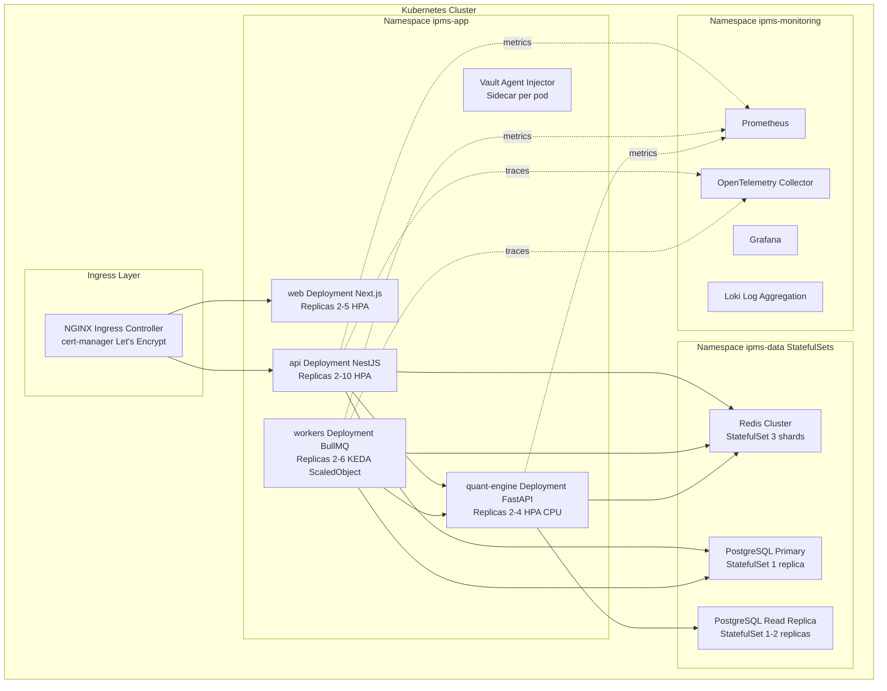

> **KEDA:** The workers deployment scales based on BullMQ queue depth (Redis list length), not CPU. Worker capacity grows in direct proportion to job backlog, not to server load.

---

## 9. Inter-Service Communication Contracts

### 9.1 NestJS to Python Quant Engine (Internal REST)

**Endpoint:** `POST /compute/risk`

```typescript
// Request — NestJS QuantEngineGateway sends:
interface QuantRiskRequest {
  userId: string;
  portfolioHash: string;          // SHA-256 of holdings state for cache keying
  holdings: HoldingForQuant[];
  homeCurrency: string;           // 'INR' | 'USD' | etc.
  benchmarkSymbol: string;        // 'NIFTY50' | 'SP500'
  computeOptions: {
    varConfidence: 0.95 | 0.99;
    varHorizonDays: number;       // 1 (default)
    minHistoryDays: number;       // 252 (default)
    includeCorrelationMatrix: boolean;
    includeScenarios: boolean;
  };
}

interface HoldingForQuant {
  holdingId: string;
  symbol: string;
  assetType: 'EQUITY' | 'CRYPTO' | 'MF';
  weightPct: number;              // current portfolio weight
  priceHistoryDays: number;       // available days of history
}
```

```python
# Response — Python Quant Engine returns:
class QuantRiskResponse(BaseModel):
    userId: str
    portfolioHash: str
    computedAt: datetime
    fromCache: bool
    priceHistoryDaysUsed: int
    var_95_1d_inr: Decimal
    var_99_1d_inr: Decimal
    cvar_95_1d_inr: Decimal
    sharpeRatio: Decimal
    sortinoRatio: Decimal
    betaVsBenchmark: Decimal
    maxDrawdownPct: Decimal
    annualisedVolatilityPct: Decimal
    portfolioRiskScore: int         # 0-100 computed score
    concentrationRisk: list[ConcentrationItem]
    correlationMatrix: list[list[float]] | None
    warnings: list[str]             # e.g., "< 252 days history — VaR may be less reliable"
```

### 9.2 Redis PubSub — Price Event Schema

**Channel:** `price:tick:{assetType}` e.g. `price:tick:crypto`, `price:tick:equity`

```json
{
  "eventType": "PRICE_TICK",
  "assetType": "CRYPTO",
  "symbol": "BTC",
  "priceInr": 5234567.89,
  "priceUsd": 62450.00,
  "changePercent1D": -2.34,
  "publishedAt": "2026-08-13T07:15:00.000Z",
  "source": "coingecko"
}
```

**Subscribers:**
- Alert Evaluator Worker — evaluates price alerts in near real-time
- Price Feed Module — updates Redis hot cache per-symbol

### 9.3 BullMQ Job Schemas

```typescript
interface ProviderSyncJobData {
  userId: string;
  providerConnectionId: string;
  providerCode: 'zerodha' | 'groww' | 'icici' | 'binance' | 'wazirx';
  triggeredBy: 'CRON' | 'USER' | 'SYSTEM';
  priority: 'HIGH' | 'NORMAL' | 'LOW';
}

interface ValuationJobData {
  userId: string;
  triggeredBySync: boolean;
  forceRefresh: boolean;
}

interface RiskComputeJobData {
  userId: string;
  portfolioSnapshotId: string;
  triggeredByValuation: boolean;
}

interface AlertEvalJobData {
  userId: string;
  trigger: 'RISK_UPDATED' | 'PRICE_TICK' | 'VALUATION_COMPLETE' | 'SCHEDULED';
  priceTickPayload?: PriceTickEvent;
}

interface NotificationJobData {
  userId: string;
  alertId: string;
  alertType: string;
  channels: ('EMAIL' | 'PUSH' | 'SMS')[];
  templateData: Record<string, unknown>;
}
```

---

## 10. Observability Architecture

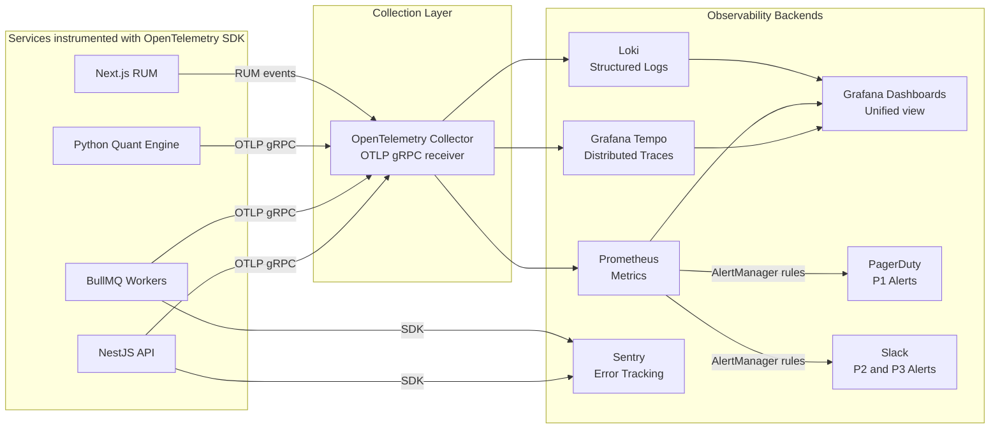

**Key Instrumentation Points:**

| Instrumentation | What is Traced / Measured |
|---|---|
| All NestJS HTTP requests | Trace ID, span per controller, DB query spans, cache hit/miss |
| BullMQ job lifecycle | Job enqueue time, processing time, retry count, failure reason |
| Python Quant Engine calls | Computation duration per metric type, cache hit rate, price history rows fetched |
| External provider API calls | Response time, status code, retry count per provider |
| PostgreSQL queries | Query duration, table, index usage via TypeORM instrumentation |
| Redis operations | Command latency, cache hit/miss ratio per key pattern |
| Alert delivery | End-to-end latency from breach detection to delivery confirmation |

---

## 11. Architecture Decision Records (ADR) Summary

> Full ADR documents to be written in `docs/adr/` directory.

| ADR | Title | Decision | Status |
|---|---|---|---|
| ADR-001 | Backend Framework | NestJS (TypeScript) Modular Monolith | Accepted |
| ADR-002 | Quant Computation | Python FastAPI Microservice (not in-process) | Accepted |
| ADR-003 | Message Queue | BullMQ over Redis (not Kafka / RabbitMQ) | Accepted |
| ADR-004 | Primary Database | PostgreSQL 16 + TimescaleDB extension | Accepted |
| ADR-005 | Secret Management | HashiCorp Vault (TOTP, API keys, OAuth tokens — not application DB) | Accepted |
| ADR-006 | PDF Generation | Puppeteer / Headless Chromium (not wkhtmltopdf / ReportLab) | Accepted |
| ADR-007 | VaR Methodology | Historical Simulation (not Parametric) — aligns with D-005 | Accepted |
| ADR-008 | Monorepo Structure | Turborepo-managed monorepo (api, workers, quant-engine, web, shared packages) | Accepted |
| ADR-009 | Service Discovery | Kubernetes internal DNS (not Consul / Eureka) | Accepted |
| ADR-010 | Auth Token Strategy | RS256 JWT (not HS256) — asymmetric for service-to-service verification | Accepted |

---

## 12. Open Questions Resolved

> All Phase 2 Architecture open questions (OQ-006 to OQ-010) are resolved.

| Question ID | Question | Resolution | Rationale |
|---|---|---|---|
| **OQ-006** | API framework: FastAPI vs NestJS? | **Both** — NestJS as modular monolith for business logic; FastAPI as dedicated quant microservice | NestJS excels at I/O-bound orchestration; Python FastAPI excels at CPU-bound matrix computation |
| **OQ-007** | Message queue: RabbitMQ vs Kafka vs AWS SQS? | **BullMQ over Redis** | Sufficient throughput for MVP/V1.0 scale; zero additional infrastructure (Redis already required for cache); native TypeScript integration; rich job management (retries, priorities, cron, deduplication) |
| **OQ-008** | TOTP secret storage: application DB vs dedicated secrets vault? | **HashiCorp Vault KV v2** — never in application DB | TOTP secrets are authentication credentials, not business data. Vault provides HSM-backed encryption, access auditing, automatic lease rotation, and complete isolation from application DB. |
| **OQ-009** | VaR computation: in-app Python engine vs external quant library? | **In-app Python engine with NumPy/Pandas + QuantLib-Python** in dedicated FastAPI microservice | FastAPI encapsulates all quant computation. QuantLib-Python for bond valuation and XIRR. NumPy/Pandas for Historical Simulation VaR, Sharpe, Beta. |
| **OQ-010** | PDF generation: Puppeteer vs wkhtmltopdf vs ReportLab? | **Puppeteer (headless Chromium)** | Pixel-perfect rendering of React-generated charts. Full CSS/JS support. Reports embed live chart images. wkhtmltopdf has poor CSS support; ReportLab requires bespoke layout code. |

---

## Appendix A — Full Portfolio Sync Sequence (End-to-End)

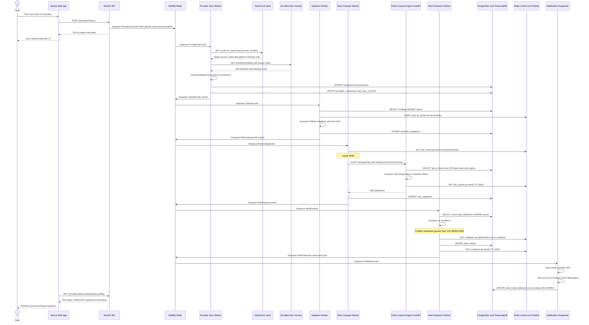

---

## Appendix B — Quant Engine OpenAPI Contract (Excerpt)

```yaml
openapi: 3.1.0
info:
  title: IPMS Quant Engine API
  version: 1.0.0
  description: >
    Internal-only. Not publicly exposed.
    Accessible only from NestJS API and BullMQ Workers
    within the private VPC subnet.

security:
  - InternalJWT: []

paths:
  /compute/risk:
    post:
      summary: Compute full risk metrics for a portfolio snapshot
      requestBody:
        required: true
        content:
          application/json:
            schema:
              $ref: '#/components/schemas/QuantRiskRequest'
      responses:
        '200':
          description: Risk metrics computed successfully
        '422':
          description: Insufficient price history — min 252 days required
        '503':
          description: TimescaleDB unavailable

  /compute/xirr:
    post:
      summary: Compute XIRR for a series of irregular cash flows
      responses:
        '200':
          description: XIRR computed successfully
        '422':
          description: XIRR non-convergent (no real solution exists)

  /health:
    get:
      summary: Health check — no auth required
      security: []
      responses:
        '200':
          description: "OK { status, db_connected, redis_connected, version }"

components:
  securitySchemes:
    InternalJWT:
      type: http
      scheme: bearer
      bearerFormat: JWT
      description: >
        RS256 JWT issued by NestJS API.
        Audience must be 'quant-engine'.
        Maximum TTL 5 minutes.
        Public key shared via Kubernetes secret mount.
```

---

*End of System Architecture Document — SA-001 v1.0.0*

*Next Phase: Phase 4 — Development Environment & CI/CD Setup*
