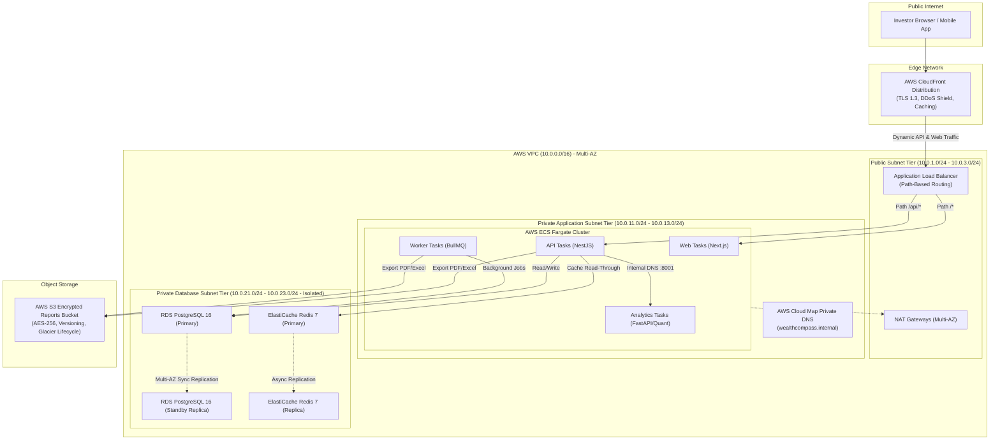

# WealthCompass Cloud Infrastructure & Deployment Guide

> **Target Audience**: Cloud Engineers, DevOps Architects, and Site Reliability Engineers (SREs).  
> **Infrastructure Stack**: AWS (ECS Fargate, RDS PostgreSQL, ElastiCache Redis, ALB, CloudFront, S3, CloudWatch) managed via Terraform (IaC).

---

## 1. Cloud Architecture Overview

WealthCompass is provisioned across multiple Availability Zones (AZs) in a dedicated AWS Virtual Private Cloud (VPC) adhering to the AWS Well-Architected Framework and strict financial defense-in-depth principles.

### 1.1 Network Topology & Security Tiering

The architecture is divided into three distinct network tiers:

1. **Tier 1: Public Subnets**
   - Hosts the internet-facing Application Load Balancer (ALB) and NAT Gateways.
   - No application code or sensitive services execute here.
2. **Tier 2: Private Application Subnets**
   - Hosts AWS ECS Fargate tasks (`api`, `web`, `analytics`, `worker`).
   - Outbound internet access is routed exclusively through NAT Gateways for container image pulls and third-party financial market data fetching.
   - Inter-service communication (e.g. NestJS `api` calling Python `analytics`) resolves via AWS Cloud Map Private DNS (`wealthcompass.internal`), never traversing the public internet.
3. **Tier 3: Private Database Subnets (Isolated)**
   - Hosts RDS PostgreSQL and ElastiCache Redis clusters.
   - **Zero Internet Access**: Subnets have no route to the Internet Gateway (IGW) or NAT Gateways.
   - **Strict Security Group Ingress**: Port `5432` (PostgreSQL) and Port `6379` (Redis) only accept packets originating from the ECS Application Security Group (`ecs_sg`). Direct bastion or public internet ingress is physically blocked.



---

## 2. Infrastructure-as-Code Directory Structure

The Terraform codebase is structured into modular, reusable building blocks and isolated environment workspaces:

```
infrastructure/terraform/
├── environments/
│   ├── staging/
│   │   ├── versions.tf             # Provider requirements & S3 backend definition
│   │   ├── variables.tf            # Staging configuration parameters
│   │   ├── main.tf                 # Module composition for staging
│   │   ├── outputs.tf              # Endpoints & resource identifiers
│   │   └── terraform.tfvars.example # Example staging variable overrides
│   └── production/
│       ├── versions.tf             # Production provider requirements & S3 backend
│       ├── variables.tf            # Production configuration parameters
│       ├── main.tf                 # Multi-AZ HA module composition
│       ├── outputs.tf              # Production cluster endpoints
│       └── terraform.tfvars.example # Example production variable overrides
└── modules/
    ├── vpc/                        # Multi-tier subnets, NAT, IGW, Route Tables, Flow Logs
    ├── security/                   # Defense-in-depth Security Groups with strict chaining
    ├── s3/                         # Secure object storage (AES-256, versioning, glacier transition)
    ├── rds/                        # PostgreSQL 16 instance with gp3 storage & SSL parameter groups
    ├── elasticache/                # Redis 7 replication group with transit & at-rest encryption
    ├── alb/                        # Application Load Balancer with HTTP->HTTPS redirect & path rules
    ├── ecs/                        # ECS Cluster, Fargate services, Task definitions, Auto-scaling
    └── cloudfront/                 # CloudFront CDN with cache behaviors and security headers
```

---

## 3. High Availability & Auto-Scaling Specification

### 3.1 RDS PostgreSQL Multi-AZ

- **Production Setting**: `multi_az = true`
- **Mechanism**: Synchronous physical block replication to an automated standby replica in a secondary AZ.
- **Failover SLA**: Automated DNS failover within 60–120 seconds with zero data loss in the event of AZ outage or hardware failure.
- **Backups**: 30-day automated snapshot retention with Point-In-Time-Recovery (PITR) granularity to the second.

### 3.2 ElastiCache Redis Replication Group

- **Production Setting**: `multi_az = true`, `num_cache_clusters = 2`
- **Security**: In-transit TLS encryption, authentication token enforcement (`AUTH`), and storage encryption at rest.
- **Failover**: Automatic failover promotes the secondary read replica to primary within 30 seconds if the primary node degrades.

### 3.3 ECS Fargate Target Tracking Auto-Scaling

Every service in ECS Fargate is governed by two independent AWS Application Auto-Scaling Target Tracking policies:

| Service                     | Min Tasks | Max Tasks | CPU Scaling Target | Memory Scaling Target | Scale-Out Cooldown | Scale-In Cooldown |
| :-------------------------- | :-------: | :-------: | :----------------: | :-------------------: | :----------------: | :---------------: |
| **API (`api`)**             |     2     |    10     |    70% average     |      80% average      |     60 seconds     |    300 seconds    |
| **Web (`web`)**             |     2     |    10     |    70% average     |      80% average      |     60 seconds     |    300 seconds    |
| **Analytics (`analytics`)** |     2     |     8     |    70% average     |      80% average      |     60 seconds     |    300 seconds    |
| **Worker (`worker`)**       |     2     |     6     |    70% average     |      80% average      |     60 seconds     |    300 seconds    |

---

## 4. Bootstrapping Remote State & DynamoDB Locking

Before deploying environments, create the shared remote state S3 bucket and DynamoDB locking table (one-time setup per AWS account):

```bash
# 1. Set environment variables
export AWS_REGION="ap-south-1"
export STATE_BUCKET="wealthcompass-terraform-state-prod"
export LOCK_TABLE="wealthcompass-terraform-locks-prod"

# 2. Create encrypted, versioned S3 bucket for Terraform state
aws s3api create-bucket \
  --bucket "$STATE_BUCKET" \
  --region "$AWS_REGION" \
  --create-bucket-configuration LocationConstraint="$AWS_REGION"

aws s3api put-bucket-versioning \
  --bucket "$STATE_BUCKET" \
  --versioning-configuration Status=Enabled

aws s3api put-bucket-encryption \
  --bucket "$STATE_BUCKET" \
  --server-side-encryption-configuration '{
    "Rules": [{ "ApplyServerSideEncryptionByDefault": { "SSEAlgorithm": "AES256" } }]
  }'

aws s3api put-public-access-block \
  --bucket "$STATE_BUCKET" \
  --public-access-block-configuration '{
    "BlockPublicAcls": true,
    "IgnorePublicAcls": true,
    "BlockPublicPolicy": true,
    "RestrictPublicBuckets": true
  }'

# 3. Create DynamoDB state lock table
aws dynamodb create-table \
  --table-name "$LOCK_TABLE" \
  --attribute-definitions AttributeName=LockID,AttributeType=S \
  --key-schema AttributeName=LockID,KeyType=HASH \
  --billing-mode PAY_PER_REQUEST \
  --region "$AWS_REGION"
```

Uncomment the `backend "s3"` block in `versions.tf` before running CI/CD automation.

---

## 5. Deployment Runbooks

### 5.1 Staging Deployment

```bash
cd infrastructure/terraform/environments/staging

# 1. Initialize Terraform modules and providers
terraform init

# 2. Validate configuration syntax
terraform validate

# 3. Generate execution plan with variables
terraform plan -var-file="terraform.tfvars" -out="staging.tfplan"

# 4. Review and apply changes
terraform apply "staging.tfplan"

# 5. Extract output endpoints
terraform output
```

### 5.2 Production Deployment (Zero-Downtime Pipeline)

In production, state modifications must follow strict change-control procedures:

```bash
cd infrastructure/terraform/environments/production

# 1. Initialize remote state backend
terraform init

# 2. Validate lint and configuration
terraform validate

# 3. Generate deterministic plan
terraform plan \
  -var-file="production.tfvars" \
  -out="production.tfplan"

# 4. SRE Peer Review: inspect resources to add, modify, or destroy
terraform show -no-color production.tfplan > plan_review.txt

# 5. Execute production rollout
terraform apply "production.tfplan"
```

---

## 6. Post-Deployment Verification & Health Checks

Once `terraform apply` completes, verify each layer:

```bash
# 1. Check ALB DNS resolution and HTTP to HTTPS 301 redirect
curl -I http://<ALB_DNS_NAME>/health

# 2. Test API health endpoint through CloudFront
curl -i https://<CLOUDFRONT_DOMAIN>/api/health
# Expected Response:
# HTTP/2 200
# {"status":"ok","database":"connected","redis":"connected"}

# 3. Inspect ECS task status
aws ecs list-tasks \
  --cluster wealthcompass-production-cluster \
  --service-name wealthcompass-production-api

# 4. Review CloudWatch Log Streams
aws logs tail /ecs/wealthcompass-production-api --since 10m
```

---

## 7. Zero-Downtime Rolling Update & Rollback Runbook

### Rolling Update Strategy

- `deployment_minimum_healthy_percent = 100`
- `deployment_maximum_percent = 200`

When new container images are pushed:

1. ECS launches new Fargate tasks running the new image.
2. The ALB target group registers new tasks and performs HTTP health checks (`/health` returning `200 OK`).
3. Once new tasks pass health checks, traffic is smoothly routed to them.
4. Old tasks are gracefully drained over 30 seconds before termination.

### Emergency Rollback Runbook

If an application bug is detected post-deployment:

```bash
# Option A: Rollback ECS service to previous task definition revision immediately (< 60s)
aws ecs update-service \
  --cluster wealthcompass-production-cluster \
  --service wealthcompass-production-api \
  --task-definition wealthcompass-production-api:<PREVIOUS_REVISION_NUMBER>

# Option B: Revert Git commit and trigger CI/CD pipeline
git revert HEAD --no-edit
git push origin main
```

---

## 8. Disaster Recovery (DR) & Backup Runbook

| Resource          | Recovery Point Objective (RPO) | Recovery Time Objective (RTO) | Backup Mechanism                                                   |
| :---------------- | :----------------------------: | :---------------------------: | :----------------------------------------------------------------- |
| **PostgreSQL DB** |          < 5 minutes           |         < 15 minutes          | Automated RDS daily snapshots + 30-day continuous transaction logs |
| **Redis Cache**   |     Cache rebuild from DB      |          < 5 minutes          | Transient read-through cache; can be repopulated dynamically       |
| **S3 Reports**    |     0 minutes (Continuous)     |          < 5 minutes          | S3 Object Versioning + Cross-Region Replication (CRR)              |

### Restoring RDS from Point-in-Time:

```bash
aws rds restore-db-instance-to-point-in-time \
  --source-db-instance-identifier wealthcompass-production-postgres \
  --target-db-instance-identifier wealthcompass-production-postgres-restored \
  --restore-time "2026-09-06T10:00:00Z" \
  --db-subnet-group-name wealthcompass-production-rds-subnet-group
```
