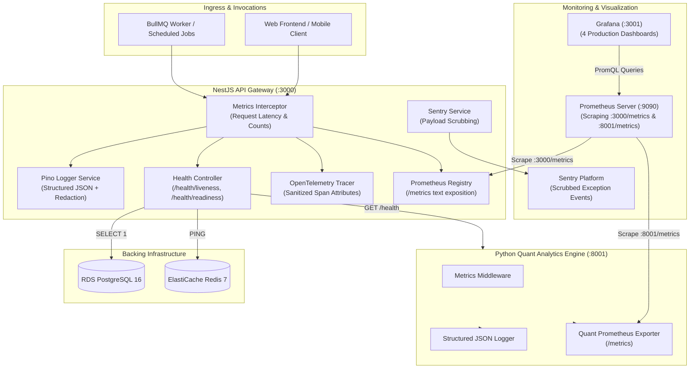

# WealthCompass Observability & Reliability Operations Guide

> **Audience**: Site Reliability Engineers (SREs), DevOps Architects, and Backend Operations.  
> **Telemetry Pillars**: Metrics (Prometheus), Logging (Pino JSON), Tracing (OpenTelemetry), Error Reporting (Sentry), Deep Health Probes, and Dashboards (Grafana).

---

## 1. Observability Architecture Overview

WealthCompass implements an enterprise-grade observability architecture adhering to Google SRE Four Golden Signals (Latency, Traffic, Errors, Saturation).



---

## 2. Health Check Probes & Service Readiness

### 2.1 Endpoint Specification

| Endpoint                | Probe Type | Purpose                                                                | Success Code |       Degraded Code       |
| :---------------------- | :--------- | :--------------------------------------------------------------------- | :----------: | :-----------------------: |
| `GET /health`           | Liveness   | Fast in-memory process alive verification                              |   `200 OK`   |            N/A            |
| `GET /health/liveness`  | Liveness   | Explicit liveness probe for Kubernetes / ECS                           |   `200 OK`   |            N/A            |
| `GET /health/readiness` | Readiness  | Deep dependency connectivity check across DB, Redis, and Python Engine |   `200 OK`   | `503 Service Unavailable` |

### 2.2 Deep Readiness Probe Response Contract

The readiness probe evaluates all 3 critical backing dependencies with sub-millisecond precision:

```json
{
  "status": "ok",
  "isHealthy": true,
  "timestamp": "2026-09-06T12:00:00.123Z",
  "uptime": 3612.45,
  "checks": {
    "database": {
      "status": "up",
      "latencyMs": 2
    },
    "redis": {
      "status": "up",
      "latencyMs": 1
    },
    "python_analytics": {
      "status": "up",
      "latencyMs": 5,
      "url": "http://localhost:8001/health"
    }
  }
}
```

If any single dependency is down or exceeds the probe timeout, the overall status is marked `degraded`, `isHealthy` becomes `false`, and HTTP `503 Service Unavailable` is returned immediately.

---

## 3. Prometheus Metrics Catalog

The API exposes standard Prometheus text exposition format at `GET /metrics`.

| Metric Name                                           |   Type    | Labels                           | Description                                        | Target SLA / Alert Rule                  |
| :---------------------------------------------------- | :-------: | :------------------------------- | :------------------------------------------------- | :--------------------------------------- |
| `wealthcompass_http_requests_total`                   |  Counter  | `method`, `route`, `status_code` | Total HTTP requests handled                        | Alert on `5xx > 1%` over 5m              |
| `wealthcompass_http_request_duration_seconds`         | Histogram | `method`, `route`, `status_code` | Latency distribution of HTTP endpoints             | **p95 < 200ms** SLA                      |
| `wealthcompass_db_connection_pool_active`             |   Gauge   | `pool`                           | Number of active PostgreSQL connections            | Alert if `active > 18` (out of 20 pool)  |
| `wealthcompass_db_query_duration_seconds`             | Histogram | `operation`, `model`             | Prisma database query latency                      | Alert on `p95 > 50ms`                    |
| `wealthcompass_bullmq_queue_depth`                    |   Gauge   | `queue_name`, `status`           | Job counts across waiting, active, delayed, failed | Alert on `waiting > 500` or `failed > 5` |
| `wealthcompass_risk_service_request_duration_seconds` | Histogram | `endpoint`, `status`             | Python Quant Engine roundtrip latency              | Alert on `p95 > 250ms`                   |
| `wealthcompass_cache_operations_total`                |  Counter  | `store`, `operation`, `result`   | Cache operations (hit, miss, invalidate)           | Target hit ratio `> 95%`                 |
| `quant_engine_requests_total`                         |  Counter  | `method`, `endpoint`, `status`   | Python Quant Engine HTTP traffic                   | Scraped from `:8001/metrics`             |
| `quant_engine_calculation_duration_seconds`           |  Summary  | `routine`, `quantile`            | Internal NumPy/Pandas math latency                 | p95 for VaR / TWR / XIRR                 |

---

## 4. Sensitive Data Redaction & Financial Compliance

To satisfy financial regulations (OWASP, GDPR, SEBI guidelines, PCI-DSS):

1. **Pino Structured Logs**:
   - `password`, `token`, `accessToken`, `refreshToken`, `authorization`, `cookie`, `secret`, `credentials`, `apiKey`, `creditCard`, `cvv` are automatically scrubbed and replaced with `[REDACTED]`.
2. **OpenTelemetry Traces**:
   - `sanitizeAttributes()` filters span attributes before export.
   - Any Bearer tokens in headers are truncated to `Bearer [REDACTED]`.
3. **Sentry Error Reporting**:
   - `sanitizeData()` recursively sweeps error payloads and extra parameters. User passwords and tokens are never forwarded to Sentry.

---

## 5. Grafana Dashboard Models

The platform provisions 4 production Grafana dashboards located in `infrastructure/grafana/dashboards/`:

1. **`api-latency.json`**:
   - HTTP Request Throughput (RPS) broken down by status code.
   - p50, p95, and p99 latency curves.
   - Top 10 slowest routes by p95 response time.
   - Live Error Rate Gauge (4xx and 5xx percentage).
2. **`queue-depth.json`**:
   - Waiting vs Active BullMQ jobs across `reports` and `alerts` queues.
   - Real-time failed job alert counter.
   - Redis cache operations (hits vs misses).
3. **`db-connections.json`**:
   - Connection pool saturation percentage.
   - Query latency percentiles (p50, p95, p99).
   - Throughput by Prisma model (`User`, `Portfolio`, `Holding`, `Transaction`).
4. **`risk-service-latency.json`**:
   - Quant Engine request rate and roundtrip latency.
   - Internal calculation duration for VaR (Historical Simulation), TWR (Modified Dietz chain-linking), XIRR (Newton-Raphson), and Asset Allocation.

---

## 6. Incident Response & Troubleshooting Runbooks

### Runbook 1: Readiness Probe Fails (`database: down`)

1. Check RDS PostgreSQL instance status:
   ```bash
   aws rds describe-db-instances --db-instance-identifier wealthcompass-staging-postgres
   ```
2. Verify security group rules:
   Ensure `ecs_sg` has permission to connect on port 5432.
3. Check PostgreSQL connection pool exhaustion:
   Query Grafana dashboard `WealthCompass — Database Connections & Latency`.

### Runbook 2: Readiness Probe Fails (`redis: down`)

1. Verify Redis process or ElastiCache replication group:
   ```bash
   aws elasticache describe-replication-groups --replication-group-id wealthcompass-staging-redis
   ```
2. Test connection manually via redis-cli:
   ```bash
   redis-cli -u $REDIS_URL ping
   ```

### Runbook 3: Readiness Probe Fails (`python_analytics: down`)

1. Verify Quant Engine container status:
   ```bash
   curl -i http://localhost:8001/health
   ```
2. Inspect Quant Engine logs:
   ```bash
   aws logs tail /ecs/wealthcompass-staging-analytics --since 15m
   ```
3. Verify internal DNS resolution (`analytics.wealthcompass.internal`).
